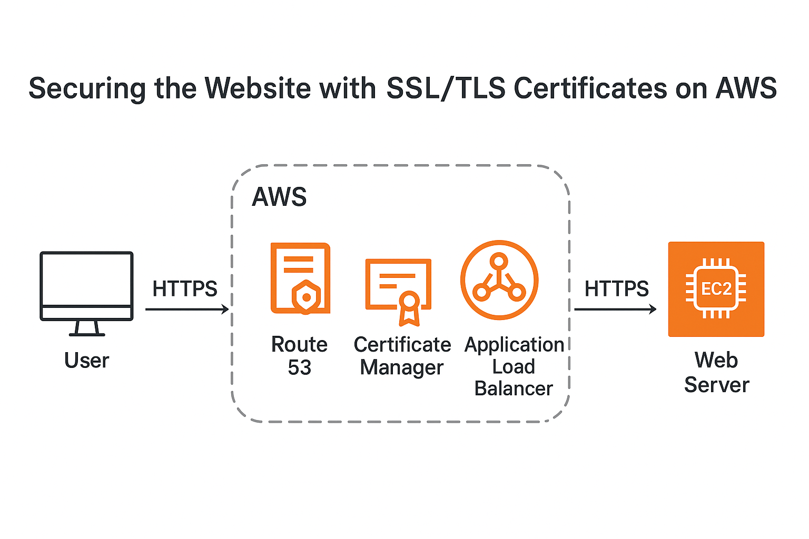

# Securing the Website with SSL/TLS Certificates on AWS
This project demonstrates how to secure a website hosted on AWS using **SSL/TLS certificates**.  
The objective is to enable **HTTPS** for secure communication, ensuring data encryption, user trust, and compliance with modern security standards.

---

## Architecture
  
 
---

## Tools & Services
- **AWS Certificate Manager (ACM)** – Provision and manage SSL/TLS certificates  
- **Amazon Route 53** – Domain registration and DNS management  
- **Application Load Balancer (ALB) / Amazon CloudFront** – Terminate HTTPS traffic and distribute securely  
- **Amazon EC2 / Amazon S3** – Hosting dynamic or static website content  
- **AWS Management Console / CLI** – Configuration and deployment  
- **Testing Tools** – SSL Labs, OpenSSL, Browser DevTools  

---

## Features
- End-to-end **HTTPS-secured** communication  
- Automated **certificate issuance and renewal** via ACM  
- **Custom domain integration** with Route 53  
- Compatibility with **ALB and CloudFront** for scalability and high availability  
- Protection of sensitive data transmitted between client and server  

---

## Deployment Steps (High-Level)
1. **Register a Domain** in Amazon Route 53 (or use an existing domain).  
2. **Request an SSL/TLS Certificate** in AWS Certificate Manager (ACM).  
3. **Validate Domain Ownership** via DNS validation in Route 53.  
4. **Attach the Certificate** to your Application Load Balancer (ALB) or CloudFront distribution.  
5. **Update Route 53 DNS Records** to route traffic through ALB/CloudFront.  
6. **Deploy Web Content** to EC2 (dynamic website) or S3 (static website).  
7. **Test HTTPS Access** using browser and SSL testing tools.  

---

## Outcome
- Website is fully secured with **HTTPS**  
- **Encrypted communication** between users and AWS infrastructure  
- Improved **trust and SEO ranking** due to SSL/TLS adoption  
- Automated certificate management reduces operational overhead  
- Scalable, production-ready architecture
  
## Documentation
For the technical step-by-step setup guide, see [SETUP](SETUP.md).

---
